# Job Scheduler - Modular Monolith

A modern, job scheduling system built with Spring Boot and Quartz Scheduler. This application provides a robust framework for managing scheduled jobs, manual triggers, real-time monitoring, and comprehensive logging.

## Table of Contents

- [Overview](#overview)
- [Features](#features)
- [Technology Stack](#technology-stack)
- [Prerequisites](#prerequisites)
- [Getting Started](#getting-started)
- [Configuration](#configuration)
- [Creating Custom Jobs](#creating-custom-jobs)
- [Running the Application](#running-the-application)
- [Monitoring & Observability](#monitoring--observability)
- [API Documentation](#api-documentation)
- [Screenshots](#screenshots)
## Overview

This project is a **modular monolith** application that provides a complete job scheduling and execution framework. It combines the power of Quartz Scheduler with Spring Boot's ecosystem to deliver a scalable, maintainable, and observable job management system.

### Key Concepts

- **Modular Monolith**: All modules run in the same JVM but are architecturally separated
- **Spring Modulith**: Enforces module boundaries and provides architectural tests
- **Quartz Scheduler**: Enterprise-grade job scheduling with clustering support
- **Abortable Jobs**: Support for cancellable long-running jobs
- **Real-time Monitoring**: Prometheus metrics and Grafana dashboards
- **Centralized Logging**: ELK stack integration with structured logging
- **Profile-based Configuration**: Different configurations for dev and prod environments

## Features

### Core Features

-  **Job Scheduling**: Quartz-based scheduling with cron expressions
-  **Manual Triggers**: Execute jobs on-demand via API
-  **Abortable Jobs**: Cancel long-running jobs in real-time
-  **Job Monitoring**: Track job executions, statuses, and history
-  **Execution Logging**: Capture and persist job logs per execution
-  **Trigger Sync**: Automatic synchronization of triggers on startup
-  **Health Checks**: Detect and cleanup stuck/zombie executions
-  **Dynamic Parameters**: Flexible job parameter system with validation

### Advanced Features

- **Cluster Support**: Multi-instance deployment with Quartz clustering
- **Custom Metrics**: Prometheus metrics for job executions
- **Grafana Dashboards**: Pre-built dashboards for monitoring
- **ELK Integration**: Centralized logging with Elasticsearch
- **Job Metadata**: Automatic discovery of job parameters and metadata
- **Parameter Types**: Support for STRING, INTEGER, BOOLEAN, ENUM, JSON, TEXTAREA
- **REST API**: Comprehensive REST API for all operations
- **OpenAPI/Swagger**: Interactive API documentation

## Technology Stack

### Core Technologies

- **Java**: 21
- **Kotlin**: 1.9.22
- **Spring Boot**: 3.3.5
- **Spring Modulith**: 1.2.4
- **Quartz Scheduler**: 2.3.2 (managed by Spring Boot)
- **Gradle**: 8.5

### Frameworks & Libraries

- **Spring Data JPA**: Database access with Hibernate
- **Spring Retry**: Retry logic for transient failures
- **MapStruct**: Object mapping
- **Jackson**: JSON processing with Kotlin support
- **Micrometer**: Metrics collection
- **Logstash Logback Encoder**: Structured logging

### Infrastructure

- **PostgreSQL**: Primary database (job definitions, executions, Quartz tables)
- **Elasticsearch**: Log storage and search
- **Logstash**: Log processing and forwarding
- **Kibana**: Log visualization and analysis
- **Prometheus**: Metrics collection and storage
- **Grafana**: Metrics visualization and dashboards

## Prerequisites

Before you begin, ensure you have the following installed:

### Required

- **JDK 21** or higher
  - Download from [Oracle](https://www.oracle.com/java/technologies/downloads/#java21) or [OpenJDK](https://openjdk.org/projects/jdk/21/)
  - Verify installation: `java -version`
  
- **Gradle 8.5** or higher (or use Gradle Wrapper)
  - The project includes Gradle Wrapper, so you don't need to install Gradle separately
  - Verify: `./gradlew --version`

### Optional (for Docker deployment)

- **Docker** 20.10+ and **Docker Compose** 2.0+
  - Download from [Docker Desktop](https://www.docker.com/products/docker-desktop)
  - Verify: `docker --version` and `docker-compose --version`

## Getting Started

### 1. Clone the Repository

```bash
git clone <repository-url>
cd job-scheduler-monolith
```

### 2. Configure Environment

Copy the environment template and configure it:

```bash
cp env.example .env
# Edit .env file with your settings
```

### 3. Start Infrastructure Services (Docker)

**Option A: Basic Services Only**
```bash
docker-compose up -d postgres
```

This will start PostgreSQL database required for the application.

**Option B: With Monitoring Stack**
```bash
docker-compose up -d postgres elasticsearch logstash kibana prometheus grafana
```

This will start all infrastructure services including the monitoring stack (ELK, Prometheus, Grafana).

### 4. Build the Project

```bash
cd job-scheduler-be
./gradlew build -x test
```

On Windows:
```bash
cd job-scheduler-be
gradlew.bat build -x test
```

### 5. Run the Application

#### Option A: Local Development (IDE)

1. Open the project in IntelliJ IDEA or your preferred IDE
2. Ensure JDK 21 is configured
3. Run `JobSchedulerApplication` main class
4. Application will start with `dev` profile by default
5. Access the API at: `http://localhost:8080`

#### Option B: Command Line

```bash
cd job-scheduler-be
./gradlew bootRun
```

#### Option C: Docker Compose (Full Stack)

```bash
# Uncomment job-scheduler-app service in docker-compose.yml
docker-compose up -d
```

This starts all services including the backend application.

### 6. Verify Installation

- **Health Check**: `http://localhost:8080/actuator/health`
- **API Docs**: `http://localhost:8080/swagger-ui.html`
- **Metrics**: `http://localhost:8080/actuator/prometheus`

## Configuration

### Application Profiles

The application supports multiple profiles:

- **dev**: Local development (default)
  - Uses `localhost` for all services
  - Debug logging enabled
  - Trigger sync on startup
  
- **prod**: Production/Docker environment
  - Uses environment variables for configuration
  - Optimized logging
  - Production-ready settings
  - Cluster-ready configuration

### Environment Variables

Key environment variables (configured in `.env`):

```bash
# Project
PROJECT_NAME=job-scheduler-be
APP_PORT=8080
FRONTEND_PORT=3001
FRONTEND_API_URL=http://localhost:8080

# Database
POSTGRESQL_HOST_PORT=5432
POSTGRESQL_USERNAME=postgres
POSTGRESQL_PASSWORD=password
POSTGRESQL_DATABASE=job_scheduler_db

# Monitoring
PROMETHEUS_HOST_PORT=9090
GRAFANA_HOST_PORT=3000
GRAFANA_ADMIN_PASSWORD=admin

# ELK Stack
ELASTICSEARCH_HOST_PORT=9200
KIBANA_HOST_PORT=5601
LOGSTASH_HOST_PORT=5000
```

### Quartz Configuration

The application uses Spring Boot's Quartz auto-configuration with:

- **Job Store**: JDBC-based (PostgreSQL)
- **Clustering**: Enabled for multi-instance deployments
- **Thread Pool**: 10 threads (configurable)
- **Misfire Policy**: Smart policy (default)

## Creating Custom Jobs

### 1. Non-Abortable Job (Simple Job)

For jobs that don't need cancellation support:

```java
package com.example.jobs;

import com.trkgrn.jobscheduler.modules.job.annotation.JobComponent;
import com.trkgrn.jobscheduler.modules.job.annotation.JobParameter;
import com.trkgrn.jobscheduler.modules.job.annotation.ParameterType;
import com.trkgrn.jobscheduler.modules.job.api.AbstractJob;
import com.trkgrn.jobscheduler.modules.job.api.JobResult;
import com.trkgrn.jobscheduler.modules.job.model.CronJobModel;
import org.jetbrains.annotations.NotNull;
import org.slf4j.Logger;
import org.slf4j.LoggerFactory;
import org.springframework.stereotype.Component;

import java.util.Map;

@JobComponent(
    displayName = "Data Cleanup Job",
    description = "Cleans up old data from various tables",
    category = "MAINTENANCE",
    parameters = {
        @JobParameter(
            name = "retentionDays",
            type = ParameterType.INTEGER,
            displayName = "Retention Days",
            description = "Number of days to retain data",
            required = true,
            validation = "min:1,max:365"
        ),
        @JobParameter(
            name = "dryRun",
            type = ParameterType.BOOLEAN,
            displayName = "Dry Run",
            description = "Preview without deleting",
            required = false,
            defaultValue = "true"
        )
    }
)
@Component("dataCleanupJob")
public class DataCleanupJob extends AbstractJob<CronJobModel> {
    
    private static final Logger LOG = LoggerFactory.getLogger(DataCleanupJob.class);
    
    @NotNull
    @Override
    public String getJobName() {
        return "Data Cleanup Job";
    }
    
    @Override
    public String getDescription() {
        return "Cleans up old data to maintain database performance";
    }
    
    @Override
    public boolean validateCronJobModel(CronJobModel cronJobModel) {
        Map<String, Object> params = cronJobModel.getParameters();
        Integer retentionDays = (Integer) params.get("retentionDays");
        
        if (retentionDays == null || retentionDays <= 0) {
            LOG.error("Invalid retention days: {}", retentionDays);
            return false;
        }
        
        return true;
    }
    
    @NotNull
    @Override
    public JobResult execute(@NotNull CronJobModel cronJobModel) {
        LOG.info("Starting data cleanup for CronJob: {}", cronJobModel.getCode());
        
        Map<String, Object> params = cronJobModel.getParameters();
        Integer retentionDays = (Integer) params.get("retentionDays");
        Boolean dryRun = (Boolean) params.getOrDefault("dryRun", true);
        
        try {
            // Your cleanup logic here
            int recordsDeleted = performCleanup(retentionDays, dryRun);
            
            String message = String.format("Cleanup completed: %d records processed", recordsDeleted);
            LOG.info(message);
            
            return new JobResult(true, message, Map.of("recordsDeleted", recordsDeleted));
            
        } catch (Exception e) {
            LOG.error("Cleanup failed: {}", e.getMessage(), e);
            return new JobResult(false, "Cleanup failed: " + e.getMessage(), null, e);
        }
    }
    
    private int performCleanup(int retentionDays, boolean dryRun) {
        // Implement your cleanup logic
        return 0;
    }
}
```

### 2. Abortable Job (Cancellable Job)

For long-running jobs that need cancellation support:

```java
package com.example.jobs;

import com.trkgrn.jobscheduler.modules.job.annotation.JobComponent;
import com.trkgrn.jobscheduler.modules.job.annotation.JobParameter;
import com.trkgrn.jobscheduler.modules.job.annotation.ParameterType;
import com.trkgrn.jobscheduler.modules.job.api.AbortableJob;
import com.trkgrn.jobscheduler.modules.job.api.CronJobResult;
import com.trkgrn.jobscheduler.modules.job.api.JobResult;
import com.trkgrn.jobscheduler.modules.job.api.PerformResult;
import com.trkgrn.jobscheduler.modules.job.model.CronJobModel;
import com.trkgrn.jobscheduler.modules.job.model.CronJobStatus;
import org.jetbrains.annotations.NotNull;
import org.slf4j.Logger;
import org.slf4j.LoggerFactory;
import org.springframework.stereotype.Component;

import java.util.Map;

@JobComponent(
    displayName = "Data Processing Job",
    description = "Processes large datasets with cancellation support",
    category = "PROCESSING",
    parameters = {
        @JobParameter(
            name = "batchSize",
            type = ParameterType.INTEGER,
            displayName = "Batch Size",
            description = "Number of records per batch",
            required = true,
            defaultValue = "1000",
            validation = "min:100,max:10000"
        ),
        @JobParameter(
            name = "totalRecords",
            type = ParameterType.INTEGER,
            displayName = "Total Records",
            description = "Total number of records to process",
            required = true,
            defaultValue = "10000"
        )
    }
)
@Component("dataProcessingJob")
public class DataProcessingJob extends AbortableJob<CronJobModel> {
    
    private static final Logger LOG = LoggerFactory.getLogger(DataProcessingJob.class);
    
    @NotNull
    @Override
    public String getJobName() {
        return "Data Processing Job";
    }
    
    @Override
    public String getDescription() {
        return "Processes large datasets with cancellation support";
    }
    
    @NotNull
    @Override
    public JobResult execute(@NotNull CronJobModel cronJobModel) {
        LOG.info("Starting data processing for CronJob: {}", cronJobModel.getCode());
        
        Map<String, Object> params = cronJobModel.getParameters();
        Integer batchSize = (Integer) params.get("batchSize");
        Integer totalRecords = (Integer) params.get("totalRecords");
        
        try {
            int processedRecords = 0;
            int totalBatches = (int) Math.ceil((double) totalRecords / batchSize);
            
            for (int batch = 0; batch < totalBatches; batch++) {
                // Check for cancellation request
                if (clearAbortRequestedIfNeeded(cronJobModel)) {
                    LOG.warn("Job cancelled at batch {}/{}", batch + 1, totalBatches);
                    return new PerformResult(
                        CronJobResult.ERROR, 
                        CronJobStatus.CANCELLED,
                        "Job cancelled by user at batch " + (batch + 1)
                    ).toJobResult();
                }
                
                // Process batch
                int recordsInBatch = Math.min(batchSize, totalRecords - processedRecords);
                LOG.info("Processing batch {}/{} ({} records)", batch + 1, totalBatches, recordsInBatch);
                
                // Your processing logic here
                processBatch(recordsInBatch);
                
                processedRecords += recordsInBatch;
                
                // Simulate processing time
                Thread.sleep(1000);
            }
            
            String message = String.format("Processing completed: %d records processed", processedRecords);
            LOG.info(message);
            
            return new PerformResult(
                CronJobResult.SUCCESS,
                CronJobStatus.FINISHED,
                message,
                Map.of("processedRecords", processedRecords)
            ).toJobResult();
            
        } catch (Exception e) {
            LOG.error("Processing failed: {}", e.getMessage(), e);
            return new PerformResult(
                CronJobResult.ERROR,
                CronJobStatus.FAILED,
                "Processing failed: " + e.getMessage(),
                null,
                e
            ).toJobResult();
        }
    }
    
    private void processBatch(int recordCount) {
        // Implement your batch processing logic
    }
}
```

### 3. Job Annotations

#### @JobComponent

Defines job metadata for automatic discovery:

```java
@JobComponent(
    displayName = "My Job",           // Display name in UI
    description = "Job description",  // Detailed description
    category = "MAINTENANCE",         // Category for grouping
    parameters = { /* ... */ }        // Job parameters
)
```

#### @JobParameter

Defines job parameters with validation:

```java
@JobParameter(
    name = "paramName",              // Parameter key
    type = ParameterType.STRING,     // Data type
    displayName = "Parameter Name",  // Display name in UI
    description = "Description",     // Help text
    required = true,                 // Is required?
    defaultValue = "default",        // Default value
    validation = "min:1,max:100",   // Validation rules
    options = "OPTION1,OPTION2"      // For ENUM type
)
```

**Supported Parameter Types:**
- `STRING`: Text input
- `INTEGER`: Numeric input
- `BOOLEAN`: Checkbox
- `ENUM`: Dropdown selection
- `JSON`: JSON object
- `TEXTAREA`: Multi-line text

## Running the Application

### Local Development

For local development, you'll run the backend application from your IDE while all infrastructure services run in Docker.

1. **Start Infrastructure Services** (excluding backend):
   ```bash
   docker-compose up -d postgres elasticsearch logstash kibana prometheus grafana
   ```
   
   This starts all required services:
   - PostgreSQL (database)
   - Elasticsearch (log storage)
   - Logstash (log processing)
   - Kibana (log visualization)
   - Prometheus (metrics collection)
   - Grafana (metrics visualization)

2. **Run Backend Application from IDE**:
   - Open the project in IntelliJ IDEA or your preferred IDE
   - Ensure JDK 21 is configured
   - Run `JobSchedulerApplication` main class
   - Application will start with `dev` profile by default

   Or from command line:
   ```bash
   cd job-scheduler-be
   ./gradlew bootRun
   ```

3. **Access**:
   - Frontend UI: http://localhost:3001
   - Backend API: http://localhost:8080
   - Swagger UI: http://localhost:8080/swagger-ui.html
   - Actuator: http://localhost:8080/actuator
   - Grafana: http://localhost:3000 (admin/admin)
   - Kibana: http://localhost:5601
   - Prometheus: http://localhost:9090

### Docker Compose (Full Stack)

```bash
docker-compose up -d
```

This starts all services:
- **Backend Application** (`job-scheduler-app`): Spring Boot application on port 8080
- **Frontend Application** (`job-scheduler-frontend`): React application on port 3001
- **PostgreSQL**: Database on port 5432
- **Elasticsearch**: Log storage on port 9200
- **Logstash**: Log processing on port 5000
- **Kibana**: Log visualization on port 5601
- **Prometheus**: Metrics collection on port 9090
- **Grafana**: Metrics visualization on port 3000

**Access Points:**
- Frontend UI: `http://localhost:3001`
- Backend API: `http://localhost:8080`
- Swagger UI: `http://localhost:8080/swagger-ui.html`
- Grafana: `http://localhost:3000` (admin/admin)
- Kibana: `http://localhost:5601`
- Prometheus: `http://localhost:9090`

**Note:** Make sure to create `.env` file from `env.example` before running docker-compose.

## Monitoring & Observability

### Metrics (Prometheus & Grafana)

The application exposes custom metrics for job monitoring:

#### Available Metrics

- **`job_execution_total`**: Total number of job executions
  - Tags: `job_name`, `status` (start, success, failed, cancelled, exception)
  
- **`job_execution_active`**: Number of currently running jobs
  - Real-time gauge metric

#### Accessing Metrics

- **Prometheus Endpoint**: `http://localhost:8080/actuator/prometheus`
- **Prometheus UI**: `http://localhost:9090`
- **Grafana**: `http://localhost:3000` (admin/admin)

#### Grafana Dashboard

A pre-built dashboard is available at `docker/monitoring/grafana/dashboards/job-scheduler-dashboard.json`

**Dashboard Panels:**
1. **Total Job Executions**: Cumulative count of all job executions
2. **Active Running Jobs**: Real-time count of running jobs with thresholds

**Importing Dashboard:**
1. Open Grafana at http://localhost:3000
2. Navigate to Dashboards → Import
3. Upload `job-scheduler-dashboard.json`
4. Select Prometheus as data source
5. Click Import

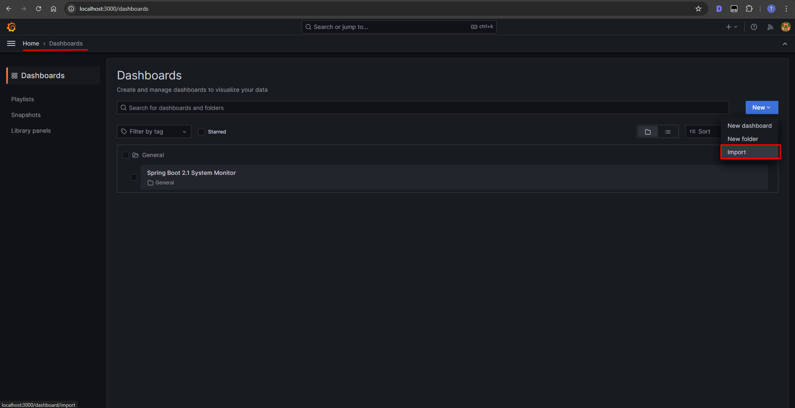
*Importing the Job Scheduler dashboard*

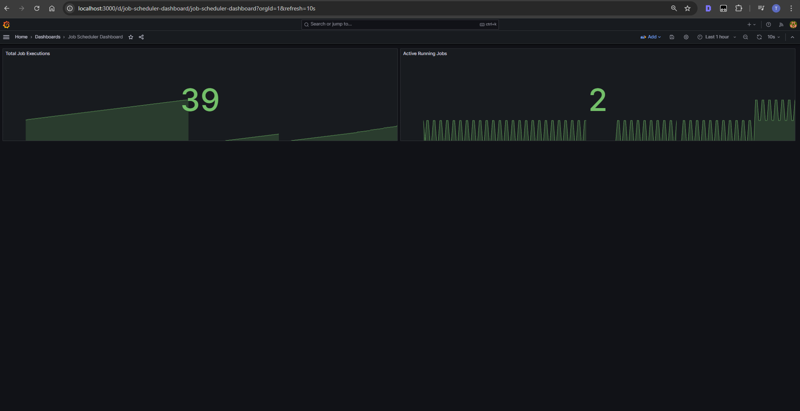
*Job Scheduler dashboard showing metrics*

### Logging (ELK Stack)

The application uses structured logging with Logstash integration:

#### Log Features

- **Structured Logging**: JSON format with correlation IDs
- **Execution Logs**: Per-execution log capture and persistence
- **Log Levels**: Configurable per job execution
- **Correlation IDs**: Track requests across services
- **Trace IDs**: Distributed tracing support

#### Accessing Logs

- **Kibana**: `http://localhost:5601`
- **Elasticsearch**: `http://localhost:9200`
- **Logstash**: Port 5000

#### Kibana Setup

1. Open Kibana at http://localhost:5601
2. Create index pattern: `logstash-*`
3. Select `@timestamp` as time field
4. Start exploring logs in Discover

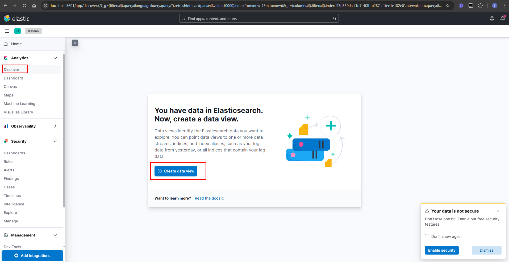
*Kibana welcome screen and initial setup*

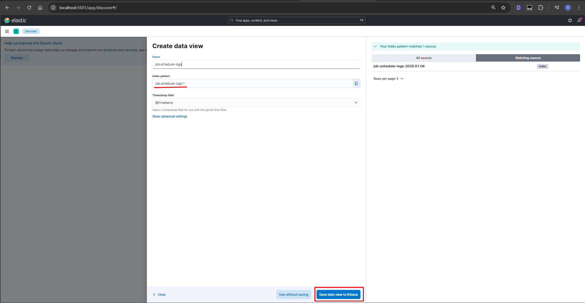
*Creating custom log views*

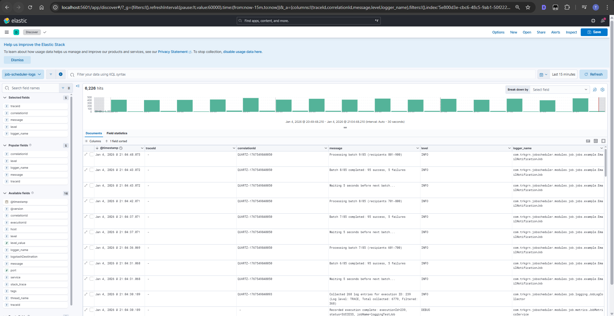
*Exploring job execution logs*

### Health Checks

The application provides comprehensive health checks:

- **Health**: `http://localhost:8080/actuator/health`
- **Info**: `http://localhost:8080/actuator/info`
- **Metrics**: `http://localhost:8080/actuator/metrics`

## API Documentation

### Swagger UI

Interactive API documentation is available via Swagger UI:

**Access**: `http://localhost:8080/swagger-ui.html`

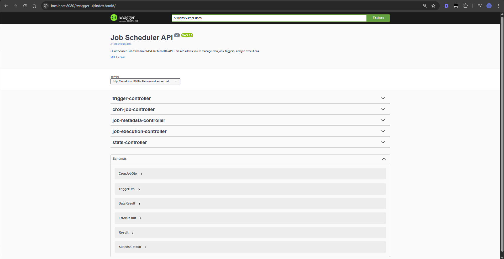
*Swagger UI showing all available endpoints*

### Main API Endpoints

#### Cron Jobs

- `GET /v1/cron-jobs` - List all cron jobs
- `GET /v1/cron-jobs/{id}` - Get cron job details
- `POST /v1/cron-jobs` - Create new cron job
- `PUT /v1/cron-jobs/{id}` - Update cron job
- `DELETE /v1/cron-jobs/{id}` - Delete cron job
- `POST /v1/cron-jobs/{id}/trigger` - Manually trigger job
- `POST /v1/cron-jobs/{id}/abort` - Abort running job

#### Triggers

- `GET /v1/triggers` - List all triggers
- `GET /v1/triggers/{id}` - Get trigger details
- `POST /v1/triggers` - Create new trigger
- `PUT /v1/triggers/{id}` - Update trigger
- `DELETE /v1/triggers/{id}` - Delete trigger
- `POST /v1/triggers/{id}/pause` - Pause trigger
- `POST /v1/triggers/{id}/resume` - Resume trigger
- `POST /v1/triggers/sync` - Sync all triggers

#### Executions

- `GET /v1/executions` - List all executions
- `GET /v1/executions/{id}` - Get execution details
- `GET /v1/executions/{id}/logs` - Get execution logs
- `GET /v1/executions/cron-job/{id}` - Get executions for cron job
- `GET /v1/executions/cron-job/{id}/paginated` - Paginated executions

#### Job Metadata

- `GET /v1/job-metadata` - List all available jobs
- `GET /v1/job-metadata/{jobBeanName}` - Get job metadata
- `POST /v1/job-metadata/{jobBeanName}/validate` - Validate job parameters

#### Statistics

- `GET /v1/stats/overview` - Get statistics overview
- `GET /v1/stats/job/{id}` - Get job-specific statistics


## Key Features Explained

### 1. Job Execution Logging

Every job execution captures logs in real-time:

- Logs are collected per execution
- Stored in database for historical analysis
- Accessible via API and UI
- Supports all log levels (TRACE, DEBUG, INFO, WARN, ERROR)

### 2. Abortable Jobs

Jobs extending `AbortableJob` can be cancelled:

```java
// In your job's execute method
for (int i = 0; i < totalItems; i++) {
    // Check for cancellation
    if (clearAbortRequestedIfNeeded(cronJobModel)) {
        return new PerformResult(
            CronJobResult.ERROR,
            CronJobStatus.CANCELLED,
            "Job cancelled by user"
        ).toJobResult();
    }
    
    // Process item
    processItem(i);
}
```

### 3. Trigger Synchronization

On application startup, all enabled triggers are automatically synchronized with Quartz:

- Reads triggers from database
- Creates/updates triggers in Quartz
- Handles misfire policies
- Supports clustering

### 4. Execution Cleanup

Detects and cleans up stuck/zombie executions:

- Runs on application startup
- Identifies executions from crashed instances
- Marks them as FAILED
- Prevents data inconsistencies

### 5. Custom Metrics

Track job performance with Prometheus:

```java
// Metrics are automatically recorded
- Job start: job_execution_total{status="start"}
- Job success: job_execution_total{status="success"}
- Job failed: job_execution_total{status="failed"}
- Job cancelled: job_execution_total{status="cancelled"}
- Active jobs: job_execution_active (gauge)
```

## Database Schema

The application uses the following main tables:

- **`cron_job`**: Job definitions
- **`trigger_model`**: Trigger configurations
- **`job_execution`**: Execution history
- **`QRTZ_*`**: Quartz scheduler tables (auto-created)

## Screenshots

### Swagger UI - API Documentation

Swagger UI provides interactive API documentation where you can explore and test all available endpoints.

#### Swagger UI Home

*Main Swagger UI interface showing all available API endpoints*

### Grafana - Metrics Visualization

Grafana provides comprehensive dashboards for monitoring job execution metrics and performance.

#### Adding Data Sources
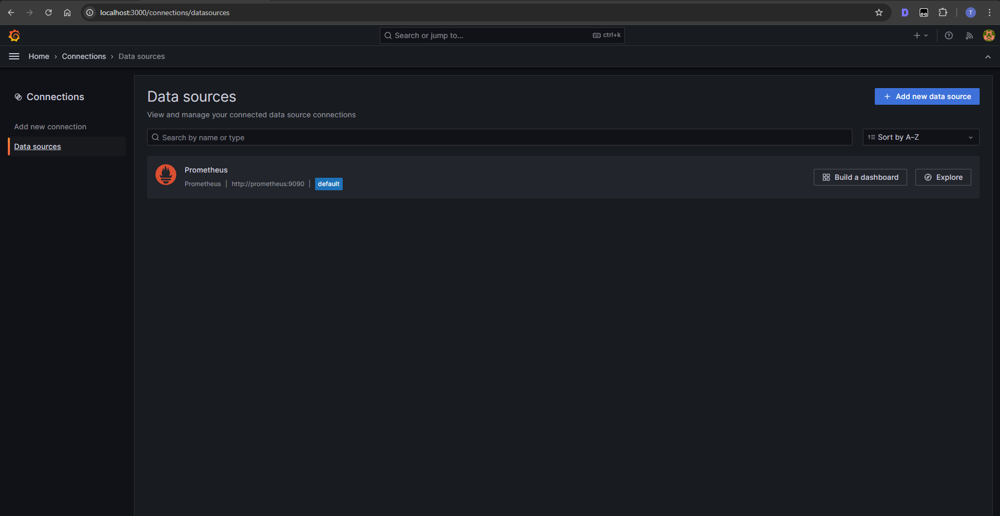
*Configuring Prometheus as a data source*

#### Importing Dashboard

*Importing the Job Scheduler dashboard*

#### Job Scheduler Dashboard

*Dashboard showing total executions and active running jobs*

### Kibana - Log Management

Kibana provides powerful log visualization and analysis capabilities for job execution logs.

#### Kibana First Screen

*Kibana welcome screen and initial setup*

#### Creating Views

*Creating custom log views and visualizations*

#### Discovering Job Logs

*Exploring job execution logs with filters*

### Frontend Dashboard

The optional React frontend provides a user-friendly interface for managing jobs.

#### Dashboard Overview
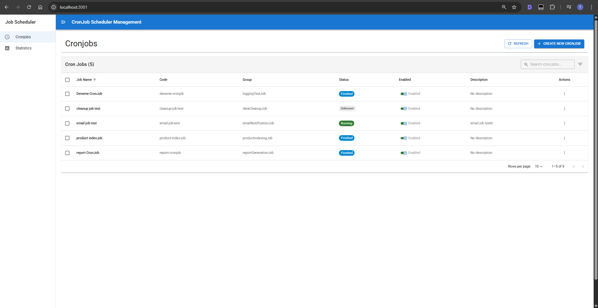
*Main dashboard showing all cron jobs and their status*

#### Job Details
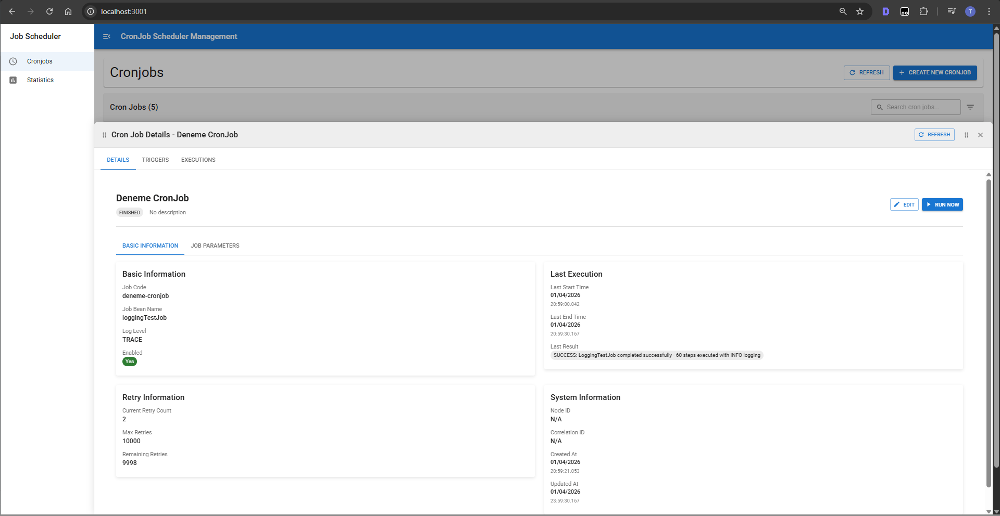
*Detailed view of a job with execution history*

#### Trigger Management
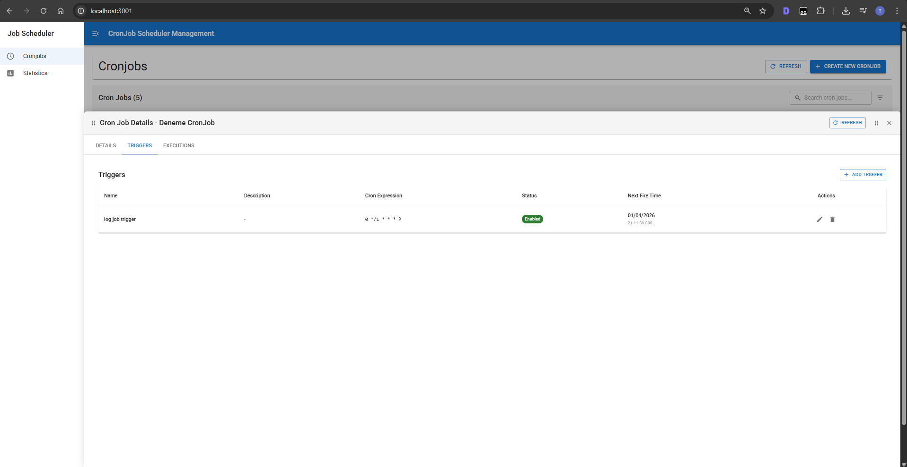
*Cron trigger creation and management interface*

#### Execution Logs
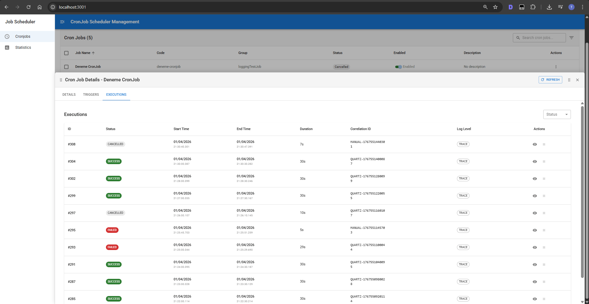
*Execution logs viewer*
